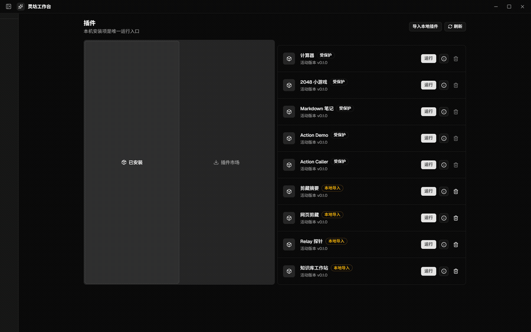
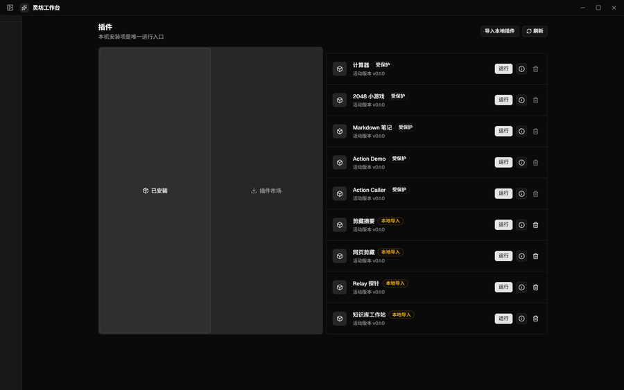
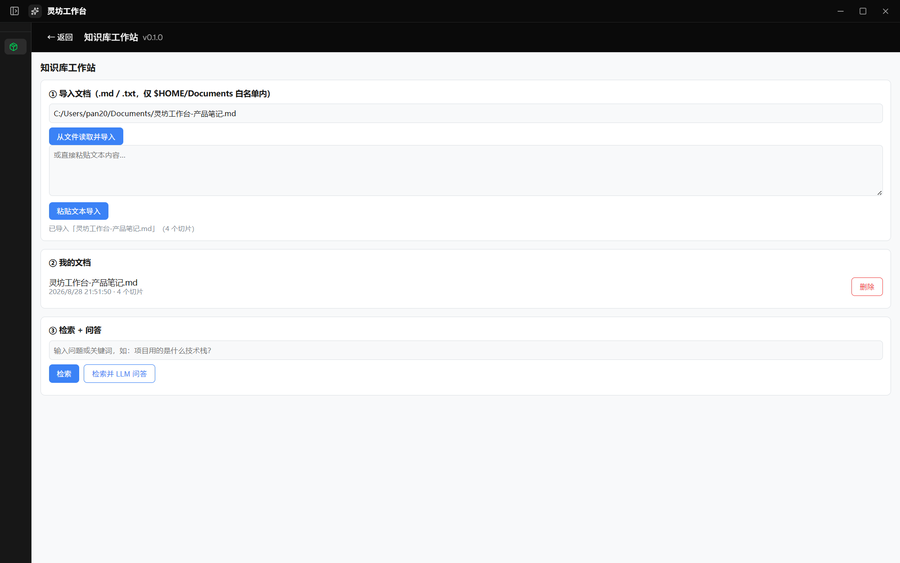
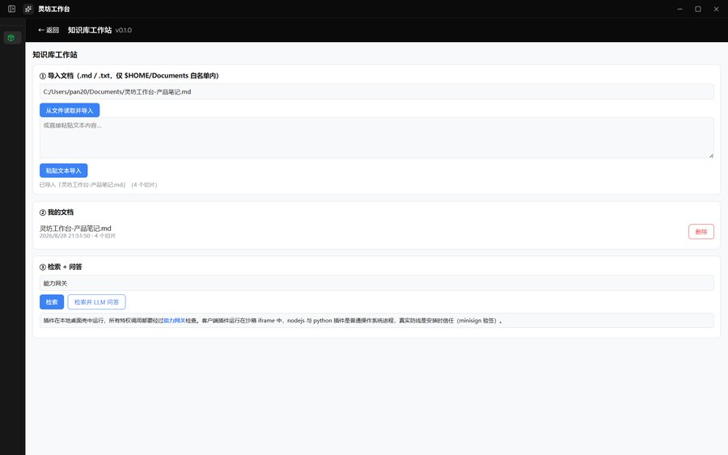
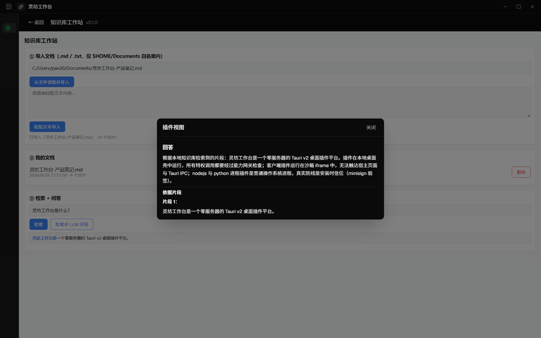

# 灵坊工作台 · 本地优先的 AI 知识库工作站

> **一句话定位**：把散落在本机的 `.md` / `.txt` 文档收进一个**本地知识库**——自动切片、关键词全文检索、带着检索片段向大模型提问。你的资料不出本机。

灵坊工作台（LingFang Workbench）是一个 Tauri v2 桌面**插件平台**：插件在本地桌面壳里运行，安装、能力鉴权、文件与 AI 调用全部由桌面壳托管。仓库名 `my-treasure` 是个人仓库占位名，产品名以「灵坊工作台」为准（exe 产物名即 `灵坊工作台`）。



## 装一个试试

前置：Windows + WebView2、Node ≥ 20、pnpm 9（Rust 改动另需 MSVC 工具链）。

```bash
pnpm install
pnpm -C apps/desktop runtime:populate   # 新克隆首次必跑：灌装内置 node/python/ffmpeg 运行时
pnpm dev:desktop                        # 启动桌面壳，打开插件中心
```

装好后你能看到：

- **插件中心**：内置计算器、2048、Markdown 笔记、动作演示、动作调用器 5 个插件，一键运行；
- **知识库工作站**（上方 Demo 的主角）：把本机文档导入成可检索的本地知识库，提问时自动携带检索片段；
- **安装与更新闭环**：`.lfplugin` 制品导入、版本回滚、自动更新（见 [`docs/release-runbook.md`](./docs/release-runbook.md)）。

## 真实场景：本地知识库（真用插件）

「知识库工作站」是项目自己每天在用的第一个垂直场景插件（client 运行时，`.lfplugin` 制品导入）。
文档全程留在本机：`fs.read` 只允许 `$HOME/Documents` 白名单内的路径，切片与索引存在插件私有
`storage.kv`，LLM 问答经宿主代理转发，插件永不持有凭据。



**① 导入**：粘贴文本，或直接从 `$HOME/Documents` 读取 `.md` / `.txt` 文件——自动按段落切片入库。



**② 检索**：关键词全文检索（CJK 二元组分词，客户端打分取 Top 3），命中片段即点即看。



**③ 问答**：带着检索片段向 LLM 提问，回答在宿主 Markdown 弹层展示，并附依据片段。



## 为什么是「零服务器」

你的文档、你的密钥、你的问答，只发生在你的电脑上：本仓库内没有后端，没有云端同步，没有账号体系。
AI 能力在应用设置中录入 relay 凭据后，经宿主代理命令转发，插件 iframe 永不持有凭据。
安全模型的三档边界（iframe 沙箱 → 进程围栏 → 安装时信任）见下方折叠区。

## 从哪开始

| 目的                                        | 入口                                                         |
| ------------------------------------------- | ------------------------------------------------------------ |
| **全部文档索引（按身份选路）**              | [`docs/index.md`](./docs/index.md)                           |
| 快速装机 + 试插件（5 分钟）                 | [`docs/getting-started.md`](./docs/getting-started.md)       |
| 开发插件（create / validate / build / dev） | [`docs/plugin-development.md`](./docs/plugin-development.md) |
| 关键决策记录（ADR）                         | [`docs/decisions/index.md`](./docs/decisions/index.md)       |
| 理解架构与能力面                            | [`CODEBUDDY.md`](./CODEBUDDY.md)                             |
| 装机与运行环境（LFS）                       | [`docs/lfs-setup.md`](./docs/lfs-setup.md)                   |
| 发版与自动更新                              | [`docs/release-runbook.md`](./docs/release-runbook.md)       |

计划与状态：第一轮 `IMPLEMENTATION_PLAN.md`（A–D 阶段，已完成）→ 第二轮
`IMPROVEMENT_PLAN.md`（E–H 阶段）→ 第三轮 `IMPROVEMENT_PLAN_3.md`（I–K 阶段）→
第四轮 `IMPROVEMENT_PLAN_4.md`（L–O 阶段）→ 第五轮 `IMPROVEMENT_PLAN_5.md`（P–T 阶段）。

---

<details>
<summary><b>技术细节：架构地图 · 安全模型 · 仓库名说明</b></summary>

### 零服务器的准确含义

本仓库内没有后端（relay / billing / RBAC 服务端已刻意移除，不要重新引入）。桌面壳是一个
客户端——插件的执行、能力鉴权、文件/网络访问全部经由 Tauri 命令与本地文件系统完成；
AI 能力（llm/image/video/audio）由用户在应用设置中录入**平台 relay 凭据**后，经宿主代理命令
转发，插件 iframe 永不持有凭据。

### 架构地图

混合 monorepo（pnpm workspace + Cargo workspace），详细指南见 [`CODEBUDDY.md`](./CODEBUDDY.md)：

| 位置                         | 内容                                                                                                                                  |
| ---------------------------- | ------------------------------------------------------------------------------------------------------------------------------------- |
| `apps/desktop`               | Tauri 壳：React 18 前端（iframe 插件容器 + 能力网关调用）+ Rust 引擎（安装账本、能力网关、进程运行器、runtime 解析器、minisign 验签） |
| `apps/desktop/installer`     | SFX 安装器 crate（流式解压注入 ~1.7GB 内置 runtime）                                                                                  |
| `packages/contract`          | host↔插件类型的唯一权威来源（Zod schema；契约漂移视为缺陷）                                                                           |
| `packages/platform-contract` | 平台侧契约（治理 / 计费 / 市场等 Zod schema，与服务端对齐）                                                                           |
| `packages/plugin-sdk`        | 插件作者 SDK + `lingfang-plugin` CLI（create/validate/build/publish）                                                                 |
| `packages/ui-tokens`         | 设计 token（CSS 变量），宿主注入每个插件 iframe                                                                                       |

### 安全模型（三档边界，如实版）

- **第一档 · client 插件是真实运行时边界**：client HTML 在沙箱 iframe（`allow-scripts`、
  无 `allow-same-origin`，不透明 origin `'null'`）中运行，唯一特权通道是宿主注入的
  `window.sdk` 门面，每次调用都校验来源并经能力网关鉴权。插件 JS 无法触达宿主页面、Tauri IPC
  或同级插件。
- **第二档 · nodejs/python 插件是生命周期围栏，不是安全边界**：进程插件在 Windows Job Object
  下运行，仅保证进程树收容与随壳退出；没有受限令牌 / 完整性级别 / 文件系统与网络隔离。
  能力网关只约束走 SDK/桥的调用——这是对诚实插件的 API 契约，不是对抗恶意插件的墙。
- **第三档 · 进程插件的真实防线是安装时信任**：`.lfplugin` 制品 minisign 验签 + 召回检查；
  v1 政策下本地导入仅接受 client 运行时，`nodejs` / `python` 安装保留给内置/一方签名插件
  （`IMPROVEMENT_PLAN.md` F2）。

</details>
